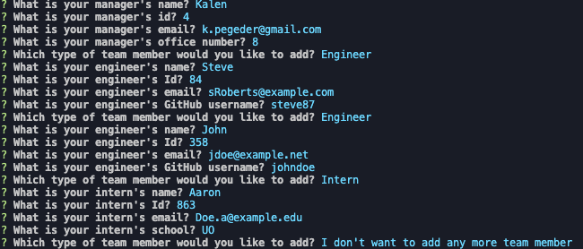
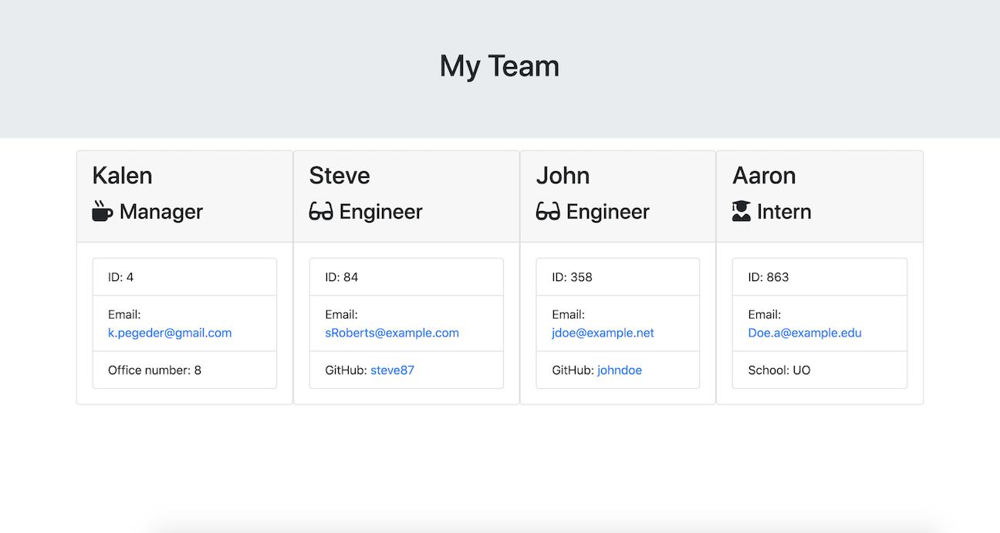

# Team Profile Generator


## _Links_

Deployed URL: https://kpegeder.github.io/team-profile-generator/Develop/output/team.html

Github Code URL: https://github.com/mx6/Bootcamp_Project_1

## Description

The app.js file is a command line application to build a software engineering team. You will be prompted to answer a set of questions about the manager, engineers and interns. There can only be one manager on the team, but there is no limit on the team size. When finished adding team members, the application will create an HTML file that displays your team.

## Table of Contents

- [Installation](#installation)
- [Usage](#usage)
- [Test](#test)
- [License](#license)
- [Questions](#questions)

## Installation

To install necessary dependencies, run the following command:

```
npm i
```

## Usage

Each of the questions must be answer to continue. If the answer doesn't fit the criteria, a message will be displayed on how to enter an acceptable response. Instructions to use the program are shown below:

1. node app.js
2. Answer each of the question
3. Team file is generated in the Develop/output




## Test

To run tests, run the following command:

```
npm run test
```

## Contributing

[Kalen Pegeder](https://github.com/kpegeder)

## License

Licensed under the MIT license.

## Questions

If you have any additional questions about the applictaion, you can contact through [email](mailto:k.pegeder@gmail.com).
You can see more of my work on [GitHub](https://github.com/kpegeder).
